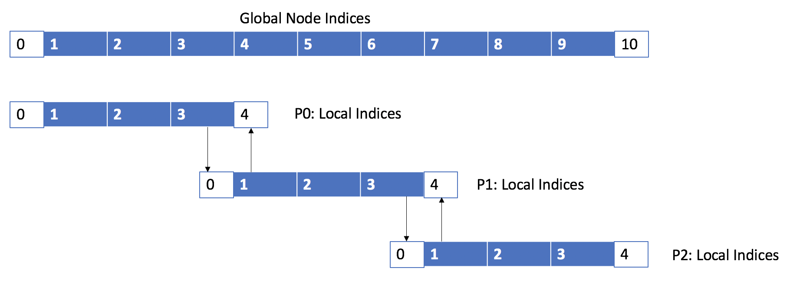

# Parallelized Matrix Vector Multiplication

In this exercise, you will implement a parallel matrix-vector multiplication. Serial version of the code is provided, `mat_vect_mul.c`, using one-dimensional arrays to store the vectors and the matrix.  In your implementation, the vector should use block distribution and the matrix is distributed by block rows. You should generate a random matrix $A$ and a random vector $x$. Measure the elapsed time for execution of the multiplication and investigate the performance of your parallel implementation. Note also that the number of processes should evenly divide both $m$ and $n$.

# Parallelized HEAT-1D Example
This exercise is based on an explicit numerical solution of one-dimensional heat equation domain decomposition. Initial temperature is zero everywhere and two boundary conditions are provided as the input. During the time-stepping, an array containing two domains is used; these domains alternate between old data and new data.

A parallelized code is provided, `heat1d_nonblocking.c`. In this parallelization, each processor has a local piece of the solution vector; at each time step, worker processes must exchange border data with neighbors, because a grid point current temperature depends upon its previous time step value plus the values of the neighboring grid points. The solution pieces overlap slightly at end points. No variable is directly updated by more than one processor; the overlap is simply to accommodate ghost cells. In this example, we discretize the interval $[0,1]$ into a number of cell of size $1/(N-1)$. Then there are $N$ points in our mesh, including the end points subject to boundary conditions. For example, for $N=11$, if we partition the points among three processors, we have the following picture:

where variables are colored and ghost cells or boundary data are white cells. Processors communicate through `Send` and `Receive`, since they must know about the entries in processors that they share a boundary with. For example, in the case of $N=11$ and $P=3$, we have, at each step:

* P0 sends entry 3 of its local vector to P1 and receives entry 4;
* P1 sends entry 1 of its local vector to P0 and receives entry 0;
* P1 sends entry 3 of its local vector to P2 and receives entry 4;
* P2 sends entry 1 of its local vector to P1 and receives entry 0;

Your assignment is to implement blocking, nonblocking, and combined `Send` and `Receive` and then study the strong and weak scaling of the code with these three different methods of communication. For each case, plot the raw time measurement for $N=6400$, and $P=1, 2, 4, 8, 16, 32, 64$. Then plot strong efficiency for $N=6400$ and weak efficiency for $N = 100, 200, 400, 800, 1600, 3200, 6400$ for $P=1, 2, 4, 8, 16, 32, 64$. You must also make sure that the time step size used for weak scaling is kept constant for all the cases so that the same number of iterations are used for the computations. Based on your observtion, which of the communication modes performs better?  

