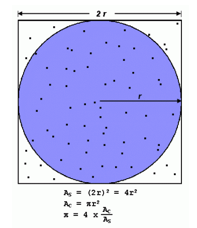

# Homework assignments 3

Consider the Monte Carlo method of approximating $\pi$. The method is based on randomly picking points on the circle/square - see figure (from: https://hpc.llnl.gov/documentation/tutorials/introduction-parallel-computing-tutorial):

* Chance of falling in circle is proportional to ratio of areas then.
* $\pi$ is four times the fraction that falls in the circle.

A serial code that uses the Monte Carlo method for computing $\pi$ is provided `pi_mc.c`. Write a parallel version of this program with OpenMP.

### HW submission
Submit a report, through `Canvas`, for the followings:

1- A description of your OpenMP implementation/s and how your serial and parallel codes scale with the number of points.

2- Speedup plot/s and a discussion on whether or not your OpenMP code approach the ideal speedup.

